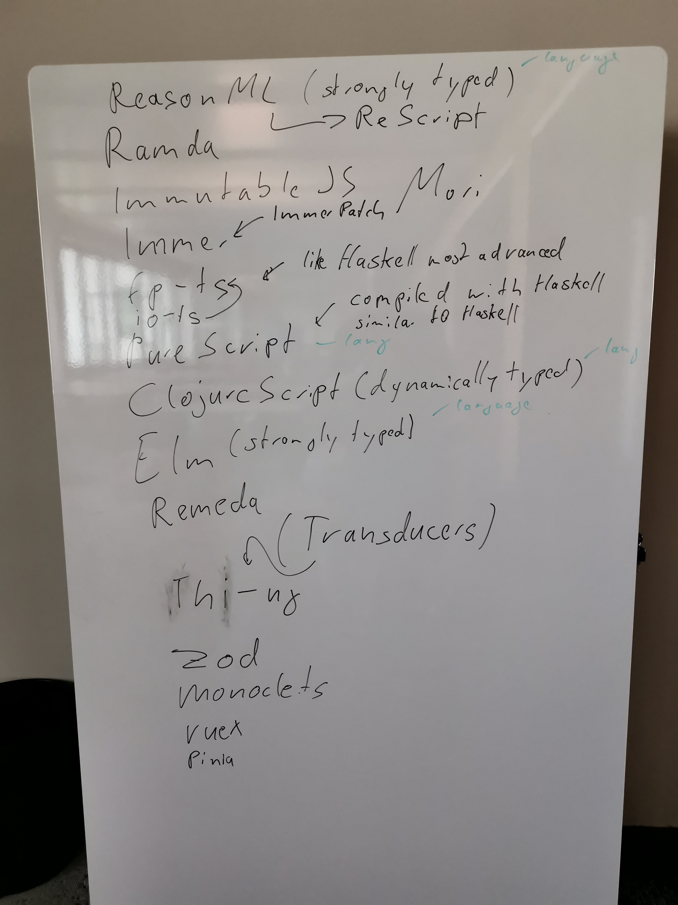

# Functional Programming Is Js And Ts
_session by Gunnar Radzom_

We looked into the functional programming libraries for JS and TS, but eventually also talked
about JavaScript Flavour-Languages and other FP-tooling in the JS eccosystem

Here is a picture with all the terms for your googling pleasure

 "FP tools in the JS eccosystem")
